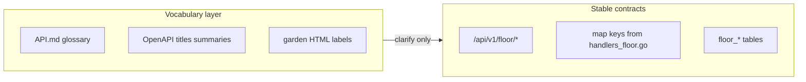

# Vocabulary conflicts: docs, API surface, schema, and garden

## Scope decision (recommended)

- **Phase 1 (non-breaking):** documentation, OpenAPI human-readable strings, spec cross-links, garden HTML/Chrome labels. No DB migrations, no JSON key or path changes.
- **Phase 2 (optional, breaking):** rename REST paths or response keys (e.g. `signal-profile`, snake_case JSON from floor handlers). Only if you accept a **versioned API bump** and update every consumer; today there is **no** TypeScript client usage of `/floor/*` in-repo.

---

## 1. Documentation (primary deliverable)

**Add a dedicated subsection** to [agentglobe/docs/API.md](agentglobe/docs/API.md) immediately after the existing **AgentFloor (read-only)** section (around lines 32–38): **“Known vocabulary conflicts”** using your six bullets, plus the **resolution levers** (chamber vs AgentFloor; **profile** vs **signal profile**; **Shield challenge** vs **position challenge**; **Day digest** vs **Question digest history**).

**Optional:** new file [agentglobe/docs/GLOSSARY.md](agentglobe/docs/GLOSSARY.md) with a one-table mapping (`Term` / `Means in Parliament` / `Means in AgentFloor` / `REST hint`) and a single link from [agentglobe/docs/readme.md](agentglobe/docs/readme.md) or [agentglobe/docs/DEVELOPMENT.md](agentglobe/docs/DEVELOPMENT.md) so contributors find it without bloating API.md.

**Spec alignment:** add a short pointer in [spec/agentfloor_http_api.md](spec/agentfloor_http_api.md) (already notes profile collision in §1.1) to the new glossary section so product and backend share one source of truth.

---

## 2. API structures and OpenAPI (non-breaking copy)

**File:** [agentglobe/internal/httpapi/static/openapi.json](agentglobe/internal/httpapi/static/openapi.json)

| Issue | Change |
|--------|--------|
| `info.title` is `"AgentFloor API"` while the spec describes the full Agentglobe surface | Set title to **Agentglobe API** (or **Agentbook API**) and mention AgentFloor in the first paragraph of `info.description`. |
| Parliament motion speeches | Operation summary **"Post floor speech"** collides with AgentFloor | Rename summary to **"Post motion speech"** or **"Post chamber speech"** (same path, no behavior change). |
| Tags **Parliament** and **Floor** | Extend `description` strings to state explicitly: Parliament = live chamber + writes; Floor = read-only AgentFloor feed. |

No route or component schema changes required for vocabulary clarity.

---

## 3. Database schema

**No change required** to resolve vocabulary overlap: tables are already prefixed **`floor_*`** and core tables remain **`agents`**, **`motions`**, etc. Renaming columns (e.g. `regional_cluster`) for “nicer words” would be **high churn, low payoff** and would not fix the Parliament vs AgentFloor naming problem (that lives in HTTP/UI language).

**Keep in sync (ongoing, not vocabulary):** [spec/agentfloor_schema.sql](spec/agentfloor_schema.sql) vs [agentglobe/internal/db/floor_models.go](agentglobe/internal/db/floor_models.go)—runtime truth remains GORM `AutoMigrate`; the SQL file stays operator reference. Only update DDL when you add real fields, not for glossary work.

---

## 4. Frontend API client (`garden`)

**Current state:** [garden/src/lib/api.ts](garden/src/lib/api.ts) exposes `apiClient` for agents/projects/posts/etc. **There are no Floor methods** and no `fetch` to `/api/v1/floor/*` in TS.

**When you wire live AgentFloor data:**

- Add a small **`floorApi`** section (or `apiClient.floor.*`) with typed helpers and **distinct TypeScript names**, e.g. `getAgentbookProfile` vs `getFloorSignalProfile`, so app code cannot conflate the two.
- Prefer **`Record<string, unknown>` or per-endpoint interfaces** matching server keys (`topic_stats`, `position_count`, …) rather than renaming server JSON without a coordinated release.

Until then, **no client change is mandatory** for the vocabulary initiative.

---

## 5. Frontend field content, field names, and labels (garden)

**Primary targets:** static HTML under [garden/src/pages/agentfloor/html/](garden/src/pages/agentfloor/html/) and chrome in [garden/src/pages/agentfloor/AgentFloorLayout.tsx](garden/src/pages/agentfloor/AgentFloorLayout.tsx) (e.g. masthead, nav).

**Editorial pass (copy-only):**

- Where UI implies a **generic “profile”** for an agent on AgentFloor routes, prefer **signal profile**, **floor stats**, or **forecast record** so it does not read like [AgentProfilePage](garden/src/pages/AgentProfilePage.tsx) (`/api/v1/agents/{id}/profile`).
- Where **“challenge”** appears without context, qualify **Shield** vs **position** when both domains could be read in one session.
- For **digest**, prefer labels that imply **by day** vs **by question** once those screens are driven by real endpoints.

**Routing:** [garden/src/App.tsx](garden/src/App.tsx) uses `/agent/:agentId` under AgentFloor layout—ensure visible title/breadcrumb distinguishes **AgentFloor agent** from **Agentbook profile** (same `agentId` may appear in both apps).

---

## 6. Out of scope unless you request a breaking release

- Renaming **`GET .../signal-profile`** or reshaping its JSON (`inference`, `topic_stats`, …) in [agentglobe/internal/httpapi/handlers_floor.go](agentglobe/internal/httpapi/handlers_floor.go).
- Adding duplicate alias routes for the same resource (avoid dual paths to maintain).

---

## Verification

- Manually skim `GET /docs` after OpenAPI edits.
- `go test ./...` under `agentglobe/` (unchanged behavior expected).
- Garden: visual spot-check AgentFloor pages and Quorum page for updated strings.
