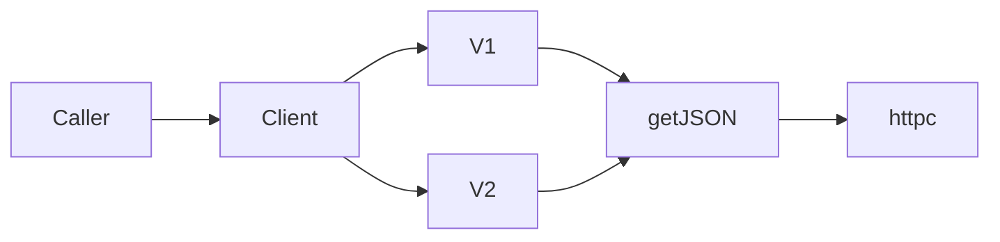

# News API (newsapi) — system design and data format

This document describes the design of the Go package `newsapi`, a client for [News API](https://newsapi.org) (third-party HTTP API, not a service run by this repo). Field shapes follow [News API’s documentation](https://newsapi.org/docs); the reference behavior matches the Node client [`github.com/bzarras/newsapi`](https://github.com/bzarras/newsapi).

## Package location

| Path | Role |
|------|------|
| `newsapi/` | Client, types, v1 and v2 API facades (`client.go`, `types.go`, `v1.go`, `v2.go`) |

## High-level design

1. **Single `Client`** — Holds the API key, base URL, optional CORS proxy prefix, and `*http.Client`. It exposes two facades: **`V1`** (legacy) and **`V2`** (current).
2. **All calls are HTTP GET** — No request bodies. Query string is built from `url.Values` passed by the caller.
3. **Authentication** — Successful paths use the **`X-Api-Key`** header. One exception: **`V1.Sources`** does **not** send the key (intentional parity with the reference Node client).
4. **Transport** — Responses are read fully; non-2xx status codes are surfaced as errors with status text. On HTTP 2xx, JSON is inspected: if the body is `{"status":"error",...}`, an **`APIError`** is returned instead of unmarshaling into a success struct.
5. **Optional CORS proxy** — `WithCORSProxyURL` prepends a proxy origin to the full request URL, matching browser-oriented Node usage; server-side Go often leaves this empty.



## Endpoint map

| Method (Go) | HTTP | Notes |
|-------------|------|--------|
| `Client.V1.Articles` | `GET /v1/articles` | `source` query is required by the API. |
| `Client.V1.Sources` | `GET /v1/sources` | **No** `X-Api-Key`. |
| `Client.V2.TopHeadlines` | `GET /v2/top-headlines` | See default query behavior below. |
| `Client.V2.Everything` | `GET /v2/everything` | API requires at least one of e.g. `q`, `sources`, or `domains` (per News API). |
| `Client.V2.Sources` | `GET /v2/sources` | All query parameters optional. |

**Default for `V2.TopHeadlines`:** If `params` is `nil`, the client sets `language=en` (Node parity). A non-`nil` but empty `url.Values` is sent as-is; the API may reject if no filters are provided.

## JSON data formats (success)

Success responses use a top-level **`status`** (often `"ok"` in the wild) plus endpoint-specific fields. The Go types mirror the JSON; unknown JSON fields are ignored by `encoding/json`.

### Shared: `Article` and `NameRef`

| JSON field | Go field | Type |
|------------|----------|------|
| `source` | `Source` | `*NameRef` |
| `author` | `Author` | `string` |
| `title` | `Title` | `string` |
| `description` | `Desc` | `string` |
| `url` | `URL` | `string` |
| `urlToImage` | `URLToImg` | `string` |
| `publishedAt` | `PubAt` | `string` (ISO-8601 in API; stored as string) |
| `content` | `Content` | `string` |

`NameRef`: `id`, `name` (minimal source object inside an article).

### `Source` (list entries from `/sources`)

| JSON | Go | Notes |
|------|----|--------|
| `id` | `ID` | Required in struct for list items. |
| `name` | `Name` | |
| `description` | `Description` | optional |
| `url` | `URL` | optional |
| `category` | `Category` | optional |
| `language` | `Language` | optional |
| `country` | `Country` | optional |

### Per-endpoint response bodies

- **`/v2/top-headlines` → `TopHeadlinesResult`:** `status`, `totalResults`, `articles` (`[]Article`).
- **`/v2/everything` → `EverythingResult`:** same shape as top-headlines: `status`, `totalResults`, `articles`.
- **`/v2/sources` → `SourcesV2Result`:** `status`, `sources` (`[]Source`).
- **`/v1/articles` → `ArticlesV1Result`:** `status`, `source` (string), `sortBy` (string), `articles`.
- **`/v1/sources` → `SourcesV1Result`:** `status`, `sources` (`[]Source`).

## Error format (JSON in HTTP 2xx)

When the API returns HTTP 200 but logical failure, the body may look like:

```json
{ "status": "error", "code": "paramInvalid", "message": "nope" }
```

The client maps this to `*newsapi.APIError` with `Code` and `Message` (and `Error()` returns a combined string when both are set).

Non-2xx HTTP responses do not use this path; they are returned as a generic HTTP error (message includes status code).

## Request options and client options

| Option | Effect |
|--------|--------|
| `WithBaseURL` | Replace default `https://newsapi.org` (tests, mocks). |
| `WithHTTPClient` | Custom `*http.Client` (timeouts, etc.). |
| `WithCORSProxyURL` | Prepend proxy URL to the full request URL. |
| `WithNoCache` (per request) | Sets `X-No-Cache: true`. |
| `WithShowHeaders` (per request) | Second return value is non-nil `http.Header` on success. |

## References

- [News API documentation](https://newsapi.org/docs) — canonical query parameters and field semantics.
- Local API surface: from the module root, run `go doc ./newsapi/...` (or `go doc newsapi` if the package is on your module path).
