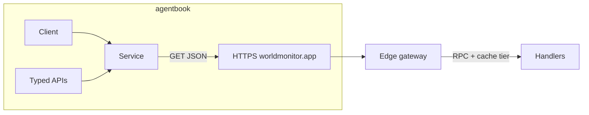

# World Monitor integration (`worldmon`)

This document describes how the **agentbook** [`worldmon`](../../worldmon/) package talks to the public **World Monitor** HTTP API: URL layout, process structure, and JSON shapes the client understands. Authoritative product and auth details remain at [worldmonitor.app](https://worldmonitor.app); server handler layout is mirrored in [koala73/worldmonitor](https://github.com/koala73/worldmonitor) (`server/worldmonitor/…`).

## Architecture at a glance

- **Client** holds base URL, optional API key, and `http.Client` (concurrent-safe; each request uses the current config).
- **Service** is a versioned view of one API *family*: path prefix `/api/{name}/{version}/` (e.g. `intelligence` + `v1`).
- **Typed APIs** (e.g. `Intelligence`, `Maritime`, `ShippingV2`) wrap `*Service` with methods named after each **RPC** (kebab-case path segment). Other domains return a bare `*Service` from helpers in `more.go` for `Fetch` only.

Successful responses are always **JSON** (`Accept: application/json`); the Go layer returns `encoding/json.RawMessage` so callers decode into app-specific types.

## HTTP contract

| Item | Value |
|------|--------|
| Default base | `https://worldmonitor.app` (override with `WithBaseURL` or `WORLDMONITOR_API_BASE`) |
| Method | **GET** only in this client |
| Path | `/api/{service}/{version}/{method}` |
| Version | Defaults to `v1` when empty; shipping uses `v2` in-tree |
| Query | Standard `url.Values` appended to the URL |

**Path pattern**

`APIPath(service, version, method)` in code resolves to:

`/api/{service}/{version}/{method}`

- **service**: kebab-case segment (e.g. `intelligence`, `consumer-prices`, `supply-chain`).
- **method**: kebab-case **file stem** of the handler under `server/worldmonitor/{service}/{version}/` (e.g. `get-risk-scores` ↔ `get-risk-scores.ts`).

Examples:

- `GET /api/intelligence/v1/get-risk-scores?region=MENA`
- `GET /api/maritime/v1/get-vessel-snapshot?…`
- `GET /api/shipping/v2/list-webhooks`

**Legacy alias (gateway map only)**  
The edge gateway’s RPC cache table also keys some paths as `/api/v2/shipping/...` (no `shipping` *service* segment in the middle). The **client** uses the regular shape `/api/shipping/v2/...`. `CacheTierForPath` recognizes both; see `worldmon/rpc_cache_tier_map.go`.

## Authentication and headers

| Constant | Header |
|----------|--------|
| `HeaderAPIKey` | `X-WorldMonitor-Key` (preferred) |
| `HeaderAPIKeyAlt` | `X-Api-Key` (legacy / alternate) |

- Key is set on the client if non-empty after trim.
- Environment: `WORLDMONITOR_API_KEY` for `NewFromEnv`; base URL from `WORLDMONITOR_API_BASE` when set.

## Data formats

### Success (2xx)

- Body: arbitrary **JSON** object or array, per endpoint.
- The `worldmon` package does not define per-RPC structs; use `json.Unmarshal` into your types or work with `json.RawMessage`.

### Error (4xx/5xx)

The edge gateway and error mapper ([gateway / error handling](https://github.com/koala73/worldmonitor/blob/main/server/gateway.ts)) return JSON that matches `worldmon.ErrorBody`:

| JSON field | Go field | Notes |
|------------|----------|--------|
| `error` | `Error` | Machine-oriented code or short id |
| `message` | `Message` | Human-readable text |
| `_debug` | `Debug` | Optional, may appear in some validation modes |
| `retryAfter` | `RetryAfter` | Optional; e.g. seconds on 429 (`*int`) |

`ParseErrorBody` prefers `error`, then `message`, else returns a trimmed string form of the raw body.

**Client behavior on error**  
`Client.doGet` returns a Go `error` for non-2xx that includes the status and a **truncated** body preview (not a structured `ErrorBody` parse in the return path). Use the response body bytes with `ParseErrorBody` if you capture them in middleware or a custom transport.

## RPC cache tiers (client-side heuristics)

`CacheTier` mirrors the public gateway’s `RPC_CACHE_TIER` (see [gateway.ts](https://github.com/koala73/worldmonitor/blob/main/server/gateway.ts)):

`fast`, `medium`, `slow`, `slow-browser`, `static`, `daily`, `no-store`

- **`CacheTierForPath(fullPath)`** — returns tier if the path is in the embedded map (`worldmon/rpc_cache_tier_map.go`). Trailing slash is normalized like the gateway.
- **`Service.MethodCacheTier(method)`** — same as `APIPath` + `CacheTierForPath` for the service’s `name`/`version`.

Use this for **expectations** (freshness, backoff), not as a second server contract; production can apply premium path overrides on the server.

## Package layout (repo `worldmon/`)

| File / area | Role |
|-------------|------|
| `client.go` | `Client`, `New` / `NewFromEnv`, options, `doGet`, `FetchV1` / `FetchV2` |
| `service.go` | `Service` and `Fetch` |
| `query.go` | Small `url.Values` helpers (`RiskScoresByRegion`, `ForecastsByRegionDomain`) |
| `errors.go` | `ErrorBody`, `ParseErrorBody` |
| `cache_tier.go` | `CacheTier`, `APIPath`, `CacheTierForPath`, `MethodCacheTier` |
| `rpc_cache_tier_map.go` | Path → tier map (keep aligned with gateway) |
| `intelligence.go`, `maritime.go`, `forecast.go`, … | Typed `*Service` wrappers + RPC methods |
| `more.go` | Generic `Client.Aviations()`-style `*Service` for domains without typed method sets yet |
| `shipping.go` | `ShippingV2` (only v2 in this client) |

**Ways to call the API**

1. **Typed**: `cl.Intelligence().GetRiskScores(ctx, q)` → fixed path and discoverability in Go.
2. **Service**: `cl.Service("economic", "v1").Fetch(ctx, "get-fred-series", q)`.
3. **Shorthand**: `cl.FetchV1(ctx, "trade", "get-trade-barriers", q)` / `FetchV2` for v2.

## Service catalog (this repo)

**Typed `*Service` structs** (each file lists its RPCs): `Intelligence`, `Maritime`, `ShippingV2`, `Forecast`, `Climate`, `Conflict`, `Cyber`, `News`, `Trade`, `Market`, `Military`, `Natural`, `Unrest`, `Seismology`.

**Generic `*Service` only** (via `more.go`): `Aviation`, `ConsumerPrices`, `Displacement`, `Economic`, `Giving`, `Health`, `Imagery`, `Infrastructure`, `Leads`, `PositiveEvents`, `Prediction`, `Radiation`, `Research`, `Resilience`, `Sanctions`, `Scenario`, `SupplyChain`, `Thermal`, `Webcam`, `Wildfire`.

For any of these, the method name is the handler stem: e.g. `cl.Economic().Fetch(ctx, "get-fred-series", nil)`.

## See also

- [Package doc (`client.go`)](../../worldmon/client.go) — links to GitHub `server/worldmonitor`, gateway, and worldmonitor.app.
- [Tests](../../worldmon/worldmon_test.go) — path construction, headers, cache tier lookups, and error body parsing.
