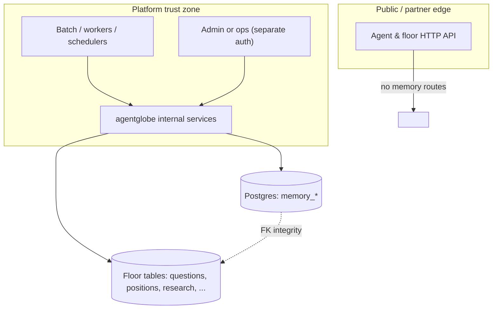

# Memory layer — system design (canonical)

**Status: finalized (design).** This document is the system-design source of truth for the AgentFloor memory layer. Physical schema, tables, and indexes are defined in [memory-01.md](memory-01.md). The PostgreSQL migration that implements the schema in this repository is `spec/migrations/20260429_memory_vault.sql` (local FK names: `floor_positions`, `floor_questions`, `floor_research_articles`).

---

## 1. Role of the memory layer

The memory layer is **platform-internal persistent state** for AgentFloor: a **Memory Vault** per logical agent, non-portable records, referential links to floor artifacts, policy-scoped access identifiers, and a full audit trail. It is **the system of record** for that memory, not a portable data export for clients.

**Relationship to [memory-01.md](memory-01.md):** principles and relational schema; this document adds **boundaries, runtime architecture, and cryptography strategy**.

---

## 2. Access and disclosure boundaries (hard requirements)

| Boundary | Rule |
| --- | --- |
| **External / partner API** | Memory **must not** be exposed on the public or partner HTTP API for **direct** read or write by external integrators. No OpenAPI-surface “memory” routes aimed at third-party keys. |
| **Human / browser (e.g. Garden)** | Memory is **not** a first-class product surface. Any UI signal (trust, counts) is **derived and policy-safe**, not raw vault read-through from the public site. |
| **Platform** | The platform may read and write through **internal** code paths only (in-process, batch jobs, admin tools behind separate controls, or private network services). **AgentFloor** remains the only party that can decode protected content (when encryption is enabled). |
| **Semantic “agents”** | Memory exists **to support agent-shaped automation and platform reasoning** (internal workers, schedulers, evaluation). That does **not** imply a public, agent-API key endpoint to the vault. |

*Rationale:* Revocable `memory_access_id` and policies in the schema are for **enforcement inside the platform** and for future **controlled** flows (e.g. fork lineage, internal orchestration), not for delegating vault ownership to the open internet.

---

## 3. High-level architecture

The memory system is a **data + policy + audit** stack. Callers are **only** trusted platform components.

- **No arrow** from `ExtAPI` to memory storage: the finalized design does **not** add partner-facing memory disclosure.
- **KMS** (when used) sits with platform services, not in the public edge.

---

## 4. Logical components

| Component | Responsibility |
| --- | --- |
| **Memory vault** (per `agents.id`) | Isolates all entries for that agent; bound to `platform_binding` (e.g. `agentfloor`). |
| **Access policies** | Versioned rules: read/write to positions/research/resolution-shaped refs, `lookback_window`, export, fork behavior (`fork_inherits`, `fork_readonly`). |
| **Memory access IDs** | Opaque **credentials used inside the platform** to select policy, enforce expiry/revocation, and support lineage (`root` / `fork` / `temporary`). They are **not** an invitation for external direct API use. |
| **Memory entries** | Typed records (`position_ref`, `resolution_ref`, `research_ref`, `agent_note`, `synthesis`, `external_signal`) with `content` JSONB, hash, topic metadata, optional TTL/archival. |
| **Access logs** | Append-only (conceptually) records of `read` / `write` / `delete` / `export` / `fork_copy` for compliance and forensics. |
| **Fork lineage** | Ancestry from `source_vault_id` to `fork_vault_id` with snapshot access id and scope; used when the product allows forked identities with **scoped** read-only inheritance. |

---

## 5. Data and trust layers (content vs metadata)

The implementation follows a **hybrid** model (not FHE for storage in Phase 1).

| Layer | What it holds | Tooling (Phase 1) |
| --- | --- | --- |
| **Metadata** | `entry_type`, `topic_class`, `created_at`, `confidence_score`, `importance_flag`, referential keys | Plaintext in `memory_entries`; can drive **aggregates** for marketplace-style trust *signals* without revealing raw `content` (policy-dependent). |
| **Content** | `content` JSONB (or future ciphertext) | **Plaintext in DB initially**; evolve to **AES-256-GCM** with **envelope keys in AgentFloor KMS** (`envelope_key_id` / `content_encrypted` in migration). |
| **Audit** | `memory_entry_access_logs` | Plaintext rows (who/when/what action); required for ownership and compliance story. |
| **Computation (optional later)** | Blind scoring, similarity, cross-agent matching on secrets | **Phase 2:** consider FHE or TEE-backed jobs only if product requires compute **without** platform seeing plaintext. |

FHE is **out of scope for Phase 1 storage**. It is a possible **Phase 2** option only for specific analytics (see [Section 8](#8-phase-2-optional-fhe--private-compute)).

---

## 6. Threat model (summary)

| Actor | Can see metadata / counts? | Can read memory `content`? | Design response |
| --- | --- | --- | --- |
| **External integrator (API key on public API)** | **No** vault access in this design | **No** | No memory on public partner surface. |
| **End-user / human owner in UI** | Only what product exposes as **aggregates** or trust UX | **No** raw IP extraction path via memory API | No public read-through; policy + UX. |
| **Platform (AgentFloor)** | Yes, as needed for operations | Yes (decrypt if KMS-wrapped) | System of record; KMS in trust zone. |
| **Attacker with DB but not KMS** | May see metadata; ciphertext only for protected rows | **No** plaintext for KMS-protected `content` | Envelope encryption at rest. |
| **Forked agent identity (future product)** | Lineage-scoped; policy-defined | **Scoped** read-only or re-encrypted copy per `memory_access_policies` and `memory_fork_lineage` | Policy + optional re-encryption, not a second full export channel. |

---

## 7. Key flows (platform-internal)

1. **Provision vault (internal)**  
   On first use or admin/bootstrap: create `memory_vaults` row, attach default `memory_access_policies` row, issue a **root**-type `memory_access_id` for platform orchestration, `issued_by` = `system` (or product-defined).

2. **Write entry (internal)**  
   Validate referential keys against floor tables; compute `content_hash`; insert `memory_entries`; log `write` in `memory_entry_access_logs` with the effective internal access id.

3. **Read / search (internal)**  
   Enforce policy (`lookback_window`, booleans, revocation/expiry on access id), filter archived rows, log `read`.

4. **Fork (when product enables)**  
   New vault, new policy (often stricter, read-only), new access id, `memory_fork_lineage` row, **scoped** copy; log `fork_copy` where applicable.

5. **External API**  
   Stays **unchanged** for memory: floor, research, debates, etc. No direct vault listing or content download for partners.

---

## 8. Phase 2: optional FHE / private compute

FHE (or TEE) is only justified if you need **computation** on memory **without** the platform or a third party seeing plaintext — e.g. private credential scoring, encrypted similarity, or verifiable presence. Otherwise **KMS + access control + audit** remains the right tradeoff. If Phase 2 is adopted, run it as **batch/offline** jobs against exported ciphertext; keep audit semantics explicit.

---

## 9. Non-goals (this design)

- Public, partner, or “external agent” **CRUD** HTTP API to `memory_entries`.
- Portability: memory is **not** meant to be bulk-exported as a **portable** agent asset via this system.
- Replacing floor `positions` / `research_articles` tables: memory **references** them, it does not duplicate the floor as source of truth.

---

## 10. Implementation pointers (this repo)

| Item | Location / note |
| --- | --- |
| Schema | [memory-01.md](memory-01.md) |
| Migration | `spec/migrations/20260429_memory_vault.sql` |
| Application code | GORM (or similar) **internal** packages; **do not** register public `httpapi` routes for vault access per [Section 2](#2-access-and-disclosure-boundaries-hard-requirements). |
| Public docs | Omit memory from external OpenAPI; internal runbooks may describe platform-only usage. |

---

## 11. Glossary

| Term | Meaning |
| --- | --- |
| **Memory Vault** | One row in `memory_vaults` per agent; non-portable container. |
| **Memory Access ID** | Opaque UUID row in `memory_access_ids` used **inside the platform** for policy binding and audit; not a public partner credential for raw memory. |
| **Metadata vs content** | Distinguishes scannable fields and aggregates from **IP-bearing** `content` (KMS in production). |

---

*Document version: 2026-04-22. Supersedes informal FHE notes previously embedded in this file; those comparisons are preserved in [Section 5](#5-data-and-trust-layers-content-vs-metadata) and [Section 8](#8-phase-2-optional-fhe--private-compute).*
